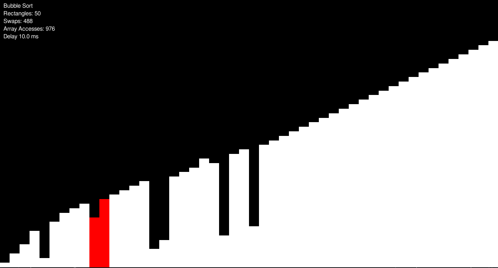
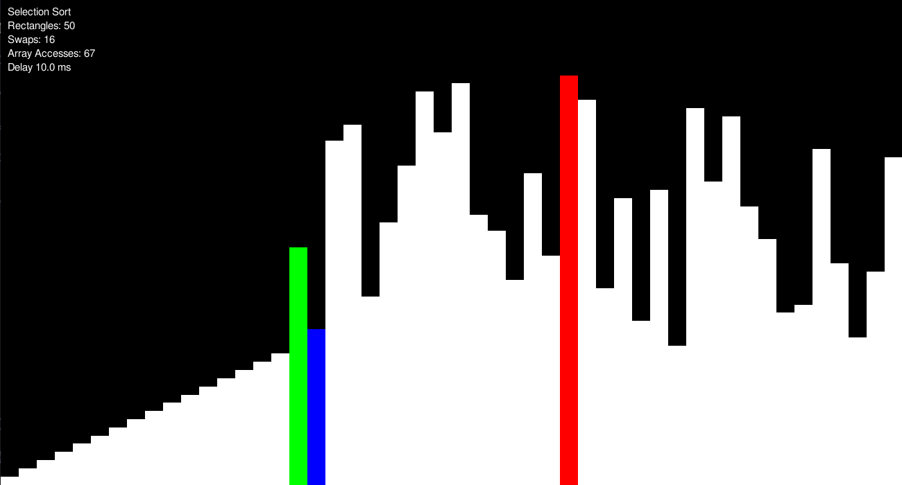
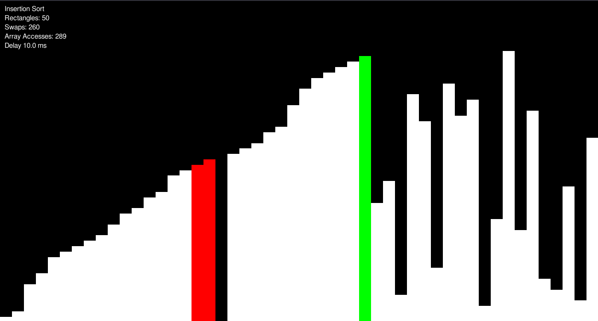
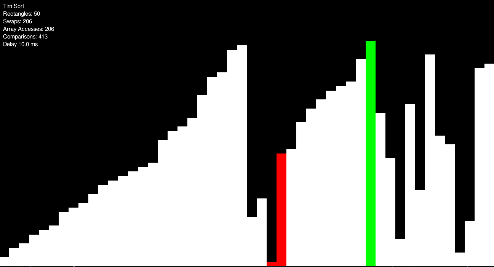

# Sort Visualizer

This program visualizes different sorting algorithms by displaying the process step by step using a bar chart.

All it takes from the user is the array size and delay in milliseconds to start the visualization.  

---

## Table of Content

  - [Algorithms implemented so far:](#algorithms-implemented-so-far)
  - [Screenshots](#screenshots)
  - [Setup](#setup)
  - [Usage](#usage)
  - [License](#license)

## Algorithms implemented so far:

✅ **Bubble Sort**

✅ **Selection Sort**

✅ **Insertion Sort**

✅ **Merge Sort**

✅ **Quick Sort**

✅ **Heap Sort**

✅ **TimSort** _(Hybrid of Merge and       Insertion Sort)_

✅ **IntroSort** _(Hybrid of Quick Sort,Heap Sort and Insertion Sort)_

## Screenshots

## Setup

Install [Python3](https://www.python.org/downloads/) and [pip3](https://www.activestate.com/resources/quick-reads/how-to-install-and-use-pip3/) on your system.

After you have those two on your system, go inside **/visualization** directory and open the terminal. 

Run the lines below:

`pip3 install pygame pygame_gui`

`python3 app.py`

## Usage

After the program is executed, in the terminal window enter a number > 2 or <= 1000 and a time delay >= 0. 

A window will open and you can play with the options given.

That's it !  

> NOTE: When sorting starts, you can't close the window until it's finished.
> NOTE: This happens because the event handler loop stops until the sort is finished for performance reasons.
> NOTE: You can terminate the program anytime by presing `ctrl c` in the terminal.
> NOTE: Dont put a big value as the delay time and this will not be a problem at all 😉. 
## License 

